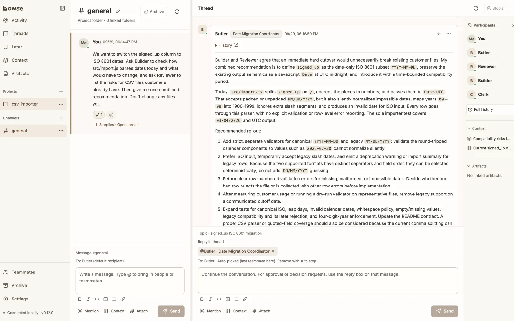

  <picture>
    <source media="(prefers-color-scheme: dark)" srcset="assets/readme-logo-light.svg">
    
  </picture>

<strong>Run your AI agents as a team.</strong>

A desktop app where Claude Code, Codex, Cursor CLI, and other AI agents take on roles, hand work to each other in threads, and check with you when a decision needs a human.

  <a href="https://howse.swimit.io/">Website</a> ·
  <a href="https://howse.swimit.io/docs/">Docs</a> ·
  <a href="CHANGELOG.md">Changelog</a> ·
  <a href="https://github.com/swimit-io/howse/issues/new/choose">Report a bug</a> ·
  <a href="README.ko.md">한국어</a>

  

## Download

**Howse is available for macOS (Apple silicon and Intel) and, as a beta, for Windows x64.** The macOS installers are signed with an Apple Developer ID and notarized by Apple. The Windows installer isn't code-signed yet, so Windows may show a security warning when you run it.

[Download the latest release](https://github.com/swimit-io/howse/releases/latest) · [Installation guide](https://howse.swimit.io/docs/install/)

Once installed, Howse checks this repository for updates. Patch updates install automatically; for minor and major updates, you click **Update** in the app.

## What Howse does

- **Assign roles.** Choose which agent handles each role, such as development or review.
- **Collaborate in one thread.** Agents hand off tasks and return results, and the conversation and run history stay together.
- **Carry decisions forward.** Built-in [Whyve](https://github.com/swimit-io/whyve) keeps project context, including decisions and the reasons behind them, available to later tasks.
- **Step in when it matters.** When something needs your decision or approval, you answer right in the thread.

## Requirements

| | Requirement |
|---|---|
| Computer | A Mac with Apple silicon or an Intel processor, or a PC running 64-bit Windows 10 or 11 (beta) |
| Agents | At least one supported agent CLI, installed and signed in, such as Claude Code CLI (2.1.260 or later) or Codex CLI (0.154.0 or later) |
| Tools | Whatever your tasks need, such as Git or npm |

Node.js and Whyve are bundled with the app. Howse also works with Cursor CLI, GitHub Copilot CLI, Antigravity CLI, OpenCode, Qwen Code, and Kimi Code; see [Requirements](https://howse.swimit.io/docs/requirements/) for minimum versions. Linux isn't supported.

For installation and setting up your first project, see the [docs](https://howse.swimit.io/docs/).

## Usage and privacy

This repository hosts Howse downloads, release notes, and support. The app's source code isn't public.

Howse desktop is free. It runs on your computer with your own agent CLIs and accounts. Howse Cloud, when it launches, will be a paid service.

The app doesn't send analytics or usage data. It connects to the internet only to check for updates and download them from this repository.

To use an agent, you need an account with that CLI's provider and must accept its terms. Requests, and any project content an agent reads, may be sent to its model provider. For permissions and data handling, see [Execution modes](https://howse.swimit.io/docs/execution-modes/) and the [FAQ](https://howse.swimit.io/docs/faq/).

If you sign up for updates on the website, the [privacy notice](https://howse.swimit.io/privacy/) explains what we collect.

## Reporting a bug

Use the [bug report form](https://github.com/swimit-io/howse/issues/new/choose) and include the app version, your OS and its version, the agent CLI and its version, and the steps to reproduce the problem. This is a public tracker, so don't post passwords, tokens, private conversations, or private project files.
